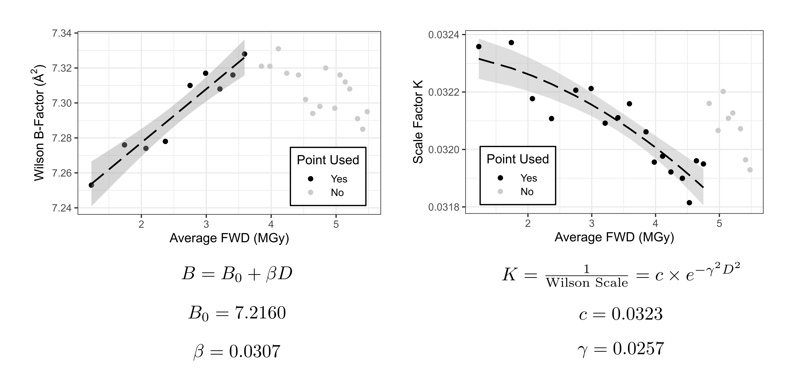
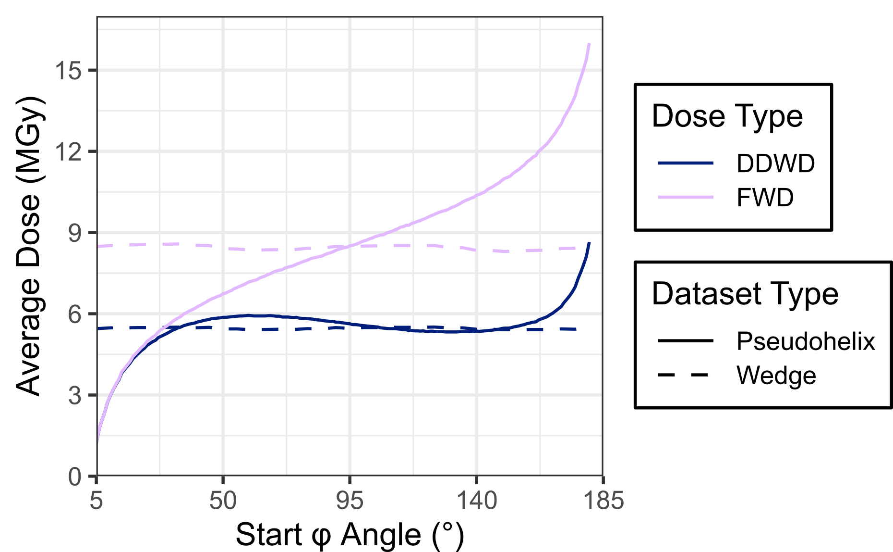
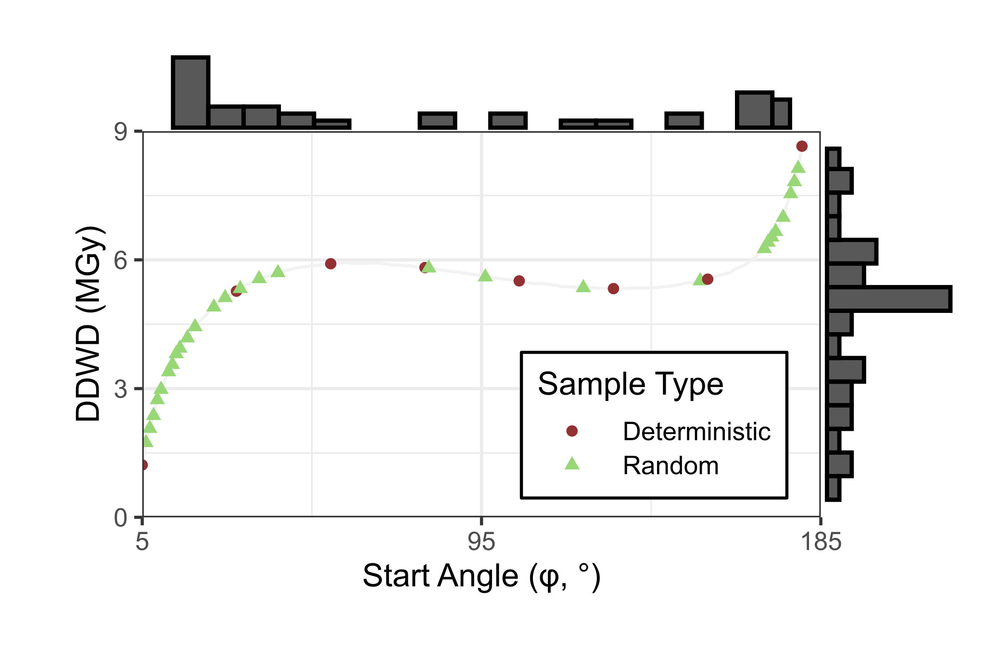

# *Nc*AA9D Dose Series Analysis Scripts

The scripts and various files in this repository were used to process data and
perform statistical analyses for the article
"Dose-dependent structural and electron density features in the lytic polysaccharide monooxygenase *Nc*AA9D" (currently under review).
This repository is organized with the intent of being transparent in methodology
and processing flow. Eight directories—numbered by their order in the pipeline—hold
the scripts and majority of input data (file size allowing) used in our analyses.

Due to the large dataset size, our analysis relied on heavy use of Bash
and R scripts to organize files, improve efficiency, minimize human error,
and maximize reproducibility/transparency. In this repository, we not only
include the R scripts for statistical analysis, but also the Bash scripts used
to ease the burden of the large dataset size. If desired, following the
instructions below should allow you to fully reproduce the data and plots used
in our article.

Detailed descriptions of each directory follow below:

0. [Diffraction images](#0-diffraction-images)
1. [FWD calculations](#1-fwd-calculations)
2. [Intensity decay parameter estimation](#2-intensity-decay-parameter-estimation)
3. [DDWD calculations](#3-ddwd-calculations)
4. [Sampling](#4-sampling)
5. [Data processing](#5-data-processing)
6. [Model refinements](#6-model-refinements)
7. [Data/model quality statistics](#7-datamodel-quality-statistics)
8. [Statistical analysis](#8-statistical-analysis)

## 0. Diffraction Images

This directory contains information on how to obtain the diffraction images used
in sections 2 and 5. The images will be publically available upon data deposition
to the Integrated Resource for Reproducibility in Macromolecular Crystallography.

## 1. FWD Calculations

While the ultimate goal of data analysis was to calculate DDWDs, we first had
to estimate intensity decay parameters required by RADDOSE-3D. To do this requires
the calculation of FWDs, which is done in this section.

This directory contains the scripts and input files used to calculate FWDs
using RADDOSE-3D.

## 2. Intensity decay parameter estimation

Our unique data collection strategy required us to calculate the average
**diffraction decay-weighted dose** for each dataset. To calculate this in
RADDOSE-3D, three parameters must be estimated:

1. *γ*: describes the dose-dependent behavior of the Gaussian scale factor (MGy-1)

2. *B0*: the Wilson B-factor at zero dose (Å2)

3. *β*: the rate of Wilson B-factor increase per unit dose (Å2/MGy)

Wilson B-factors and Wilson scale factors were estimated for the first 25 possible
pseudohelix datasets using [DIALS](https://dials.github.io/index.html) (v3.26) and
[WILSON](https://www.ccp4.ac.uk/html/wilson.html) (v9.0.011). Diffraction
decay parameters were then estimated by least-squares regression in R, according
to the method described in [Dickerson *et al*. (2024)](https://doi.org/10.1002/pro.5005).
Further details of this analysis are available in our article.

If you'd like to replicate the analysis from scratch, you will need the 
diffraction images. These are available at **LINK COMING**, and should be extracted 
into 0-diffraction_images. Alternatively, intermediate files used to run the R 
script are located at 2-decay_parameter_estimation/input/r_input/.

## 3. DDWD Calculations

The decay parameters estimated in Section 2 were used to calculate the
average diffraction decay-weighted doses (DDWDs) for our wedge datasets in
[RADDOSE-3D](https://github.com/GarmanGroup/RADDOSE-3D) (v5.01058). The average 
fluence-weighted doses (FWDs), which don't require these parameters, were also
calculated. Finally, an R script was used to calculate the FWDs and DDWDs for
the pseudohelix datasets, as this can't be done natively with RADDOSE.

## 4. Sampling

Weighted random sampling was used to select a set of pseudohelix datasets to use in 
analysis. Higher weights were given to pseudohelices with higher rates of 
average DDWD accumulation, with the goal of obtaining a sample set
representative of the whole dose range achieved in our study.

Note that sampling.R hard-codes the random seed to produce the same sample set
used in our article. If you'd like to see the random sampling in action, remove
the line `set.seed(12)` from the script and run it again.

## 5. Data Processing

After the sample set was determined by section 3, we processed the diffraction
images in [DIALS](https://dials.github.io/index.html) (v3.26) to obtain scaled
and merged reflections files appropriate for use in structure refinement.

To replicate the data processing, you will need the diffraction images.
These are available at **LINK COMING**, and should be extracted into
0-diffraction_images.

## 6. Model Refinements

After processing the desired datasets, the relevant reflections files and a
"base" *Nc*AA9D model were used as an input in [phenix.refine](https://phenix-online.org/documentation/reference/refinement.html)
(v1.21.2-5419) to determine the structure corresponding to each dataset. This is a computationally
hefty process, so we don't recommend you run the relevant scripts. The .mtz files are 
also no included in this directory due to their large file size, and must 
be generated by running the scripts in directory 5. We have, though,
included the configuration files and Bash scripts used in this step of the
process.

## 7. Data/Model Quality Statistics

We calculated data and model quality statistics via phenix.table_one. The output
of this step was used to make Supplementary Tables S1-S12 in the article, as well
as Supplementary Figure S3.

## 8. Statistical Analysis

The analysis pipeline built for this analysis imports and parses the .pdb files, 
storing structure parameters in a large table. Multiple linear regression models
are then calculated for parameters of interest versus dose and chain ID (see
the publication for more details). PCA and *k*-means clustering is also performed
on the wedge and pseudohelix datasets. Details for the statistical analysis
are provided in our article. The script also generates plots which were
used in the paper.
